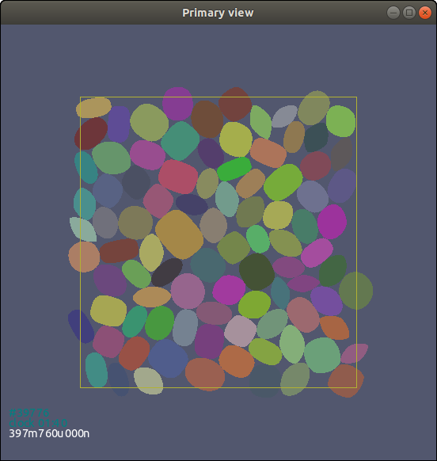
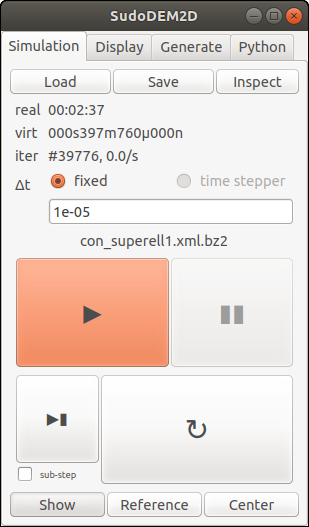
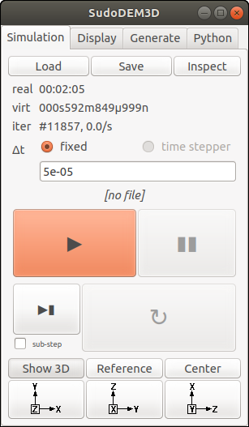
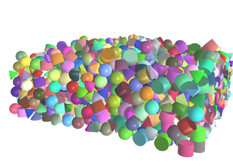

# Gallery

## GUI

## <i>SudoDEM3D</i>

<iframe src="https://player.vimeo.com/video/330169944" width="500" frameborder="0" align="middle" allow="autoplay; fullscreen" allowfullscreen></iframe>
Triaxial Compression

A triaxial compression test of poly-superellipsoidal particles.

Mixture of Cubes and Spheres

Mixture of cones, spheres, cylinders and polyhedrons

Packing of polyhedral particles

A cubic packing of super-ellipsoidal particles

## <i>SudoDEM2D</i>
<!--

-->

Shear of super-elliptical particles with periodic boundaries

[Back to top](#top)
